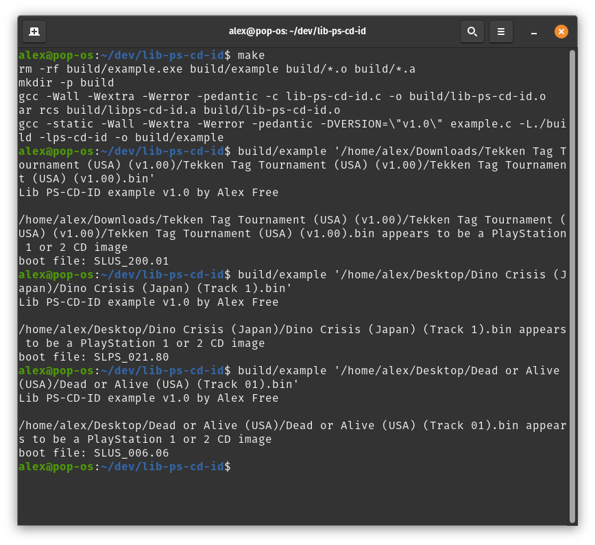

# Lib PS-CD-ID - A PlayStation 1/2 CD Image Identification Library

_by Alex Free_

This is a C library that can be used in your program to:

1) Ensure validity of a PlayStation 1 or 2 CD disc image in MODE2/2352 format.

2) Get the boot file name (i.e. SLUS_XXX.XX) in the disc image.

3) Identify different disc images that share the same boot file name by checking revision differences.

An example has been included ([example.c](https://github.com/alex-free/lib-ps-cd-id/blob/master/example.c)) that uses this library as well as my [EzRe](https://github.com/alex-free/ezre) build system. The example is portable to many operating systems (see [how to build](build.md)) and simply uses all 3 functions mentioned above:

| [Homepage](https://alex-free.github.io/lib-ps-cd-id) | [GitHub](https://github.com/alex-free/lib-ps-cd-id) | [PSX-Place Thread](https://www.psx-place.com/threads/lib-ps-cd-id-a-playstation-1-2-disc-image-identification-library.44040/) | [GBATemp Thread](https://gbatemp.net/threads/lib-ps-cd-id-a-playstation-1-2-cd-image-identification-library.657339/)

## Version History

### v1.0 (6/19/2024)

*   Initial release.

## Usage

`int is_ps_cd(FILE *bin);` returns 1 if `bin` is a PlayStation 1 or 2 CD image in MODE2/2352 format. Returns 0 if it is not. Should be called before any of the functions below.

`int get_boot_file_name(FILE *bin);` Returns boot file name in `bin` as `char boot_file[11];`.

`int id_rev(FILE *bin, const unsigned int difference_offset, const unsigned char old_byte, const unsigned char new_byte);` Returns 0 if `bin` has `old_byte` at `difference_offset`. Returns 1 if `bin` has `new_byte` at `difference_offset`. Returns 2 if neither are found at `different_offset`.

Please see `example.c` in the source directory for implementation.

## License

Lib PS-CD-ID is released with the 3-BSD license, see the [license](license) for more info.
